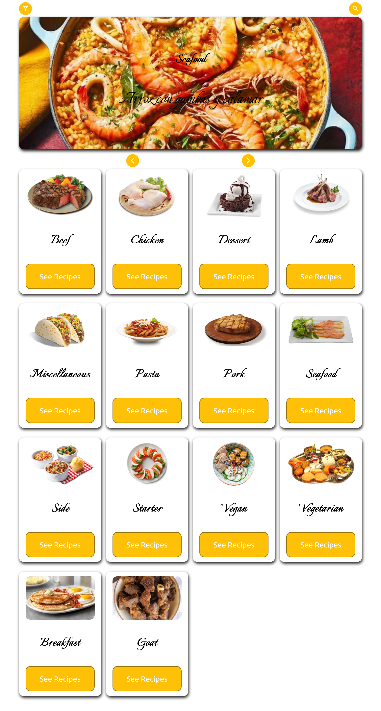
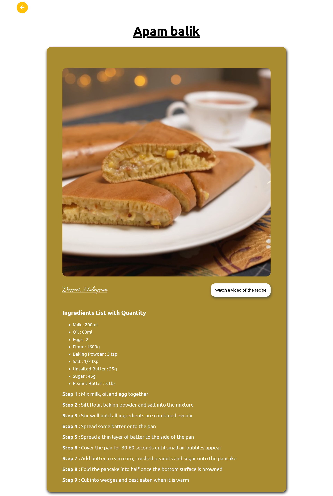

# 🍳 Recipe Finder Website

A responsive web application for discovering, searching, and exploring recipes from around the world. Built with vanilla JavaScript and powered by TheMealDB API.


## 📋 Table of Contents

- [Features](#features)
- [Demo](#demo)
- [Technologies Used](#technologies-used)
- [Installation](#installation)
- [Usage](#usage)
- [Project Structure](#project-structure)
- [API Reference](#api-reference)
- [Screenshots](#screenshots)
- [Known Issues](#known-issues)
- [Future Enhancements](#future-enhancements)
- [Contributing](#contributing)
- [License](#license)
- [Contact](#contact)

## ✨ Features

### Core Functionality
- 🔍 **Smart Search** - Search recipes by name with instant results
- 🎲 **Random Recipe Carousel** - Discover new dishes with an interactive slider
- 📂 **Category Browsing** - Explore recipes by food categories
- 🥗 **Ingredient Filtering** - Find recipes based on main ingredients
- 🌍 **Area-based Search** - Discover cuisine from different regions
- 📱 **Responsive Design** - Seamless experience across all devices

### User Experience
- Interactive navigation with smooth transitions
- Auto-hide search and filter options
- Back navigation throughout the app
- Visual recipe cards with images
- Detailed recipe pages with:
  - Ingredient lists with measurements
  - Step-by-step instructions
  - YouTube video links
  - Category and area tags

## 🚀 Demo

### Live Preview
[https://5h-am.github.io/simple_plate/#]

### Quick Start
```bash
# Clone the repository
git clone https://github.com/yourusername/recipe-website.git

# Navigate to project directory
cd recipe-website

# Open in browser
open index.html
```

## 🛠️ Technologies Used

- **HTML5** - Semantic markup structure
- **CSS3** - Styling with responsive design
  - CSS Grid & Flexbox
  - Custom properties
  - Media queries
- **JavaScript (ES6+)** - Client-side logic
  - Fetch API
  - DOM manipulation
  - Event handling
  - Session Storage
- **External Resources**
  - [TheMealDB API](https://www.themealdb.com/api.php) - Recipe data
  - [Google Fonts](https://fonts.google.com/) - Italianno & Ubuntu fonts
  - [Material Icons](https://fonts.google.com/icons) - UI icons

## 📦 Installation

### Prerequisites
- A modern web browser (Chrome, Firefox, Safari, Edge)
- Internet connection (for API calls)

### Steps

1. **Download the project**
   ```bash
   git clone https://github.com/yourusername/recipe-website.git
   ```

2. **Navigate to the directory**
   ```bash
   cd recipe-website
   ```

3. **File structure should be:**
   ```
   recipe-website/
   ├── index.html
   ├── style.css
   ├── script.js
   └── README.md
   ```

4. **Open the application**
   - Double-click `index.html`, or
   - Use a local server (recommended):
     ```bash
     # Python 3
     python -m http.server 8000
     
     # Node.js (with http-server)
     npx http-server
     ```

5. **Access in browser**
   - Direct: Open `index.html`
   - Local server: `http://localhost:8000`

## 💡 Usage

### Browsing Recipes

1. **Explore Random Recipes**
   - Use arrow buttons to navigate through random meal suggestions
   - Click on any featured recipe card to view details

2. **Search by Name**
   - Click the search icon (🔍)
   - Enter recipe name
   - Click "Search" button

3. **Filter Options**
   - Click the filter icon (⚙️)
   - Choose from:
     - **Category** (e.g., Dessert, Seafood, Vegetarian)
     - **Main Ingredient** (e.g., Chicken, Salmon, Rice)
     - **Area** (e.g., Italian, Mexican, Chinese)
   - Enter search term and submit

4. **View Recipe Details**
   - Click "See Recipes" on category cards
   - Click "See Recipe" on individual recipe cards
   - Recipe page includes:
     - High-quality image
     - Complete ingredient list with measurements
     - Step-by-step cooking instructions
     - Link to instructional video

### Navigation

- **Back Buttons**: Navigate to previous screens
- **Category Cards**: Browse all available categories
- **Auto-hide Features**: Search and filters auto-hide after timeout

## 📁 Project Structure

```
recipe-website/
│
├── index.html          # Main HTML structure
│   ├── Navigation bar
│   ├── Filter options
│   ├── Animation/carousel section
│   ├── Category cards container
│   ├── Recipe cards container
│   └── Recipe detail page
│
├── style.css           # Styling and responsive design
│   ├── Global styles
│   ├── Component styles (cards, buttons, navigation)
│   ├── Layout (grid, flexbox)
│   └── Media queries (600px, 1200px)
│
└── script.js           # Application logic
    ├── DOM element selection
    ├── API integration
    ├── Event listeners
    ├── Dynamic content generation
    └── Navigation control
```

## 🔌 API Reference

This project uses [TheMealDB API](https://www.themealdb.com/api.php) - a free recipe API.

### Endpoints Used

| Endpoint | Purpose | Example |
|----------|---------|---------|
| `/categories.php` | Fetch all categories | All meal categories |
| `/random.php` | Get random meal | Random recipe |
| `/filter.php?c={category}` | Filter by category | Desserts, Seafood |
| `/filter.php?i={ingredient}` | Filter by ingredient | Chicken, Rice |
| `/filter.php?a={area}` | Filter by area | Italian, Chinese |
| `/search.php?s={name}` | Search by name | "Spaghetti" |
| `/lookup.php?i={id}` | Get recipe details | Full recipe info |

### API Response Example

```javascript
{
  "meals": [
    {
      "idMeal": "52772",
      "strMeal": "Teriyaki Chicken Casserole",
      "strCategory": "Chicken",
      "strArea": "Japanese",
      "strInstructions": "...",
      "strMealThumb": "https://...",
      "strIngredient1": "soy sauce",
      "strMeasure1": "3/4 cup",
      // ... more ingredients
    }
  ]
}
```

## 📸 Screenshots

### Home Page

*Browse categories and discover random recipes*

### Recipe Details

*Detailed recipe with ingredients and instructions*

### Search Feature

*Recipes list as per your search or selected category*

## ⚠️ Known Issues

1. **Random Meal Carousel**
   - Fetches 7 meals but displays when 4 are loaded (potential race condition)
   - May cause inconsistent initial display

2. **State Management**
   - Page reload on certain back navigation loses all state
   - Session storage used for temporary UI state

3. **Error Handling**
   - Limited user feedback on API failures
   - No retry mechanism for failed requests

4. **Accessibility**
   - Missing ARIA labels on interactive elements
   - Incomplete keyboard navigation support

5. **Performance**
   - No image lazy loading
   - All API calls happen synchronously

## 🔮 Future Enhancements

### Planned Features
- [ ] Favorites/Bookmarking system (localStorage)
- [ ] Recipe sharing functionality
- [ ] Print recipe option
- [ ] Dark mode toggle
- [ ] Advanced filters (cooking time, difficulty)
- [ ] User ratings and reviews
- [ ] Recipe recommendations
- [ ] Offline support (PWA)
- [ ] Multi-language support

### Code Improvements
- [ ] Refactor to modern framework (React/Vue)
- [ ] Implement proper state management
- [ ] Add unit tests
- [ ] Optimize API calls (caching, debouncing)
- [ ] Improve accessibility (WCAG compliance)
- [ ] Add loading skeletons
- [ ] Implement error boundaries
- [ ] Use async/await throughout

## 🤝 Contributing

Contributions are welcome! Here's how you can help:

1. **Fork the repository**
2. **Create a feature branch**
   ```bash
   git checkout -b feature/AmazingFeature
   ```
3. **Commit your changes**
   ```bash
   git commit -m 'Add some AmazingFeature'
   ```
4. **Push to the branch**
   ```bash
   git push origin feature/AmazingFeature
   ```
5. **Open a Pull Request**

### Contribution Guidelines
- Follow existing code style
- Add comments for complex logic
- Test thoroughly before submitting
- Update documentation as needed

## 📄 License

This project is licensed under the MIT License - see the [LICENSE](LICENSE) file for details.

```
MIT License

Copyright (c) 2024 [Your Name]

Permission is hereby granted, free of charge, to any person obtaining a copy
of this software and associated documentation files (the "Software"), to deal
in the Software without restriction, including without limitation the rights
to use, copy, modify, merge, publish, distribute, sublicense, and/or sell
copies of the Software...
```

## 📞 Contact

**Your Name**
- GitHub: [5h-am](https://github.com/5h-am)
- Email: surajrxl06@gmail.com
- LinkedIn: [Shubham Kumar](https://www.linkedin.com/in/5h-am)

**Project Link**: [https://github.com/yourusername/recipe-website](https://5h-am.github.io/simple_plate/#)

---

## 🙏 Acknowledgments

- [TheMealDB](https://www.themealdb.com/) - For the amazing free API
- [Google Fonts](https://fonts.google.com/) - For beautiful typography
- [Material Icons](https://fonts.google.com/icons) - For clean, modern icons
- All contributors and users of this project

---

### 📊 Project Stats

- **Lines of Code**: ~500+ (JavaScript), ~300+ (CSS)
- **API Endpoints**: 6
- **Responsive Breakpoints**: 2 (600px, 1200px)
- **External Dependencies**: 0 (vanilla JavaScript)

---

**Made with ❤️ and ☕**

*If you found this project helpful, please consider giving it a ⭐!*